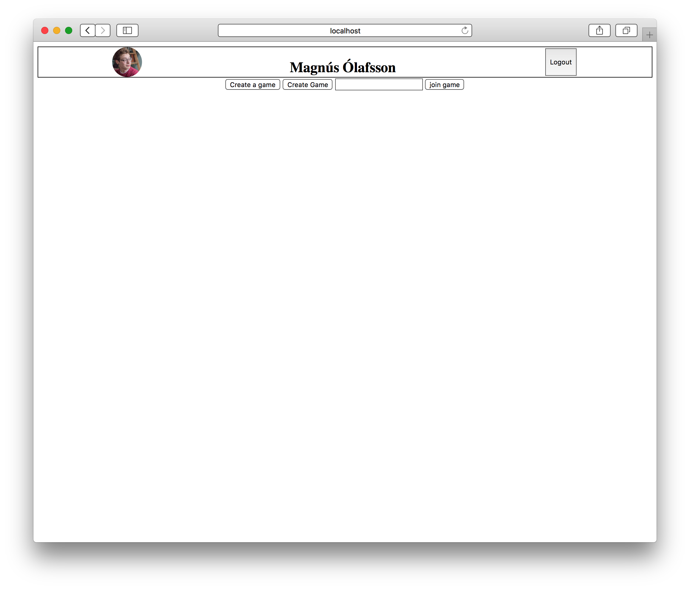

# Draw Something!

## Get started
### Download Dependencies
```console
 yarn install
```

### Start Local Server
```console
 yarn start
```

### Build App
```console
 yarn build
```

## Screenshots
### Login

### Home

### Lobby

### Lobby w/ Users

### Game
